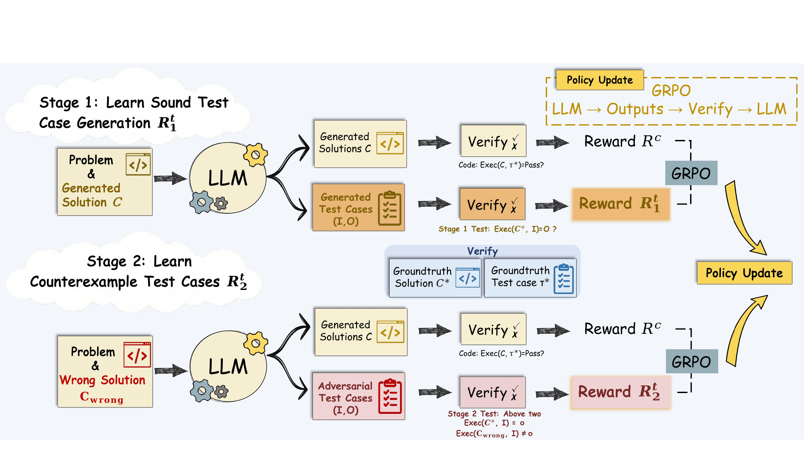

# TCS: Two-Stage Reinforcement Learning for Sound and Adversarial Test Generation in Code LLMs

[](https://2026.emnlp.org/)
[](https://huggingface.co/XiaoBanni/TCS-7B)
[](https://huggingface.co/XiaoBanni/TCS-1.5B)
[](https://huggingface.co/datasets/XiaoBanni/TACO-Train)

Official repository for the Findings of EMNLP 2026 paper **"Two-Stage Reinforcement Learning for Sound and Adversarial Test Generation in Code LLMs"**.

*Jiacheng Xu, Wentao Zhang, Zhiyi Lyu, Fuxiang Zhang, Chaojie Wang, Yang Liu, Bo An*

> 🚧 **Code release status**: we are cleaning up the codebase and will upload it here shortly. The trained checkpoints and the processed training data are already available (see below). Watch/star this repo to get notified when the code lands.

## Overview

**Test Cases Scaling (TCS)** is a two-stage RL framework that teaches a code LLM to generate test cases that are both **sound** (consistent with a ground-truth solution) and **adversarial** (counterexamples targeting the solver's current failure modes):

- **Stage 1 (Soundness)**: the verifier learns to generate tests that agree with the ground-truth solution, with prompts drawn from a rolling **policy-aligned buffer** of the solver's own outputs.
- **Stage 2 (Counterexample)**: the buffer is restricted to executable-but-incorrect candidates, and the verifier is rewarded only for tests that pass the reference solution while failing the paired incorrect program.
- **Inference-time scaling**: sample N candidate programs, generate tests conditioned on each candidate, execute everything, and select the candidate with the highest pass-count.



## Released artifacts

| Artifact | Link |
|---|---|
| TCS-7B (fine-tuned from DeepSeek-R1-Distill-Qwen-7B) | [XiaoBanni/TCS-7B](https://huggingface.co/XiaoBanni/TCS-7B) |
| TCS-1.5B (fine-tuned from DeepSeek-R1-Distill-Qwen-1.5B) | [XiaoBanni/TCS-1.5B](https://huggingface.co/XiaoBanni/TCS-1.5B) |
| Processed TACO training split (6,318 verified problems) | [XiaoBanni/TACO-Train](https://huggingface.co/datasets/XiaoBanni/TACO-Train) |

The checkpoints are standard causal LMs and load directly with `transformers`:

```python
from transformers import AutoModelForCausalLM, AutoTokenizer

model = AutoModelForCausalLM.from_pretrained("XiaoBanni/TCS-7B", torch_dtype="auto", device_map="auto")
tokenizer = AutoTokenizer.from_pretrained("XiaoBanni/TCS-7B")
```

## Citation

```bibtex
@inproceedings{xu2026tcs,
  title     = {Two-Stage Reinforcement Learning for Sound and Adversarial Test Generation in Code {LLM}s},
  author    = {Jiacheng Xu and Wentao Zhang and Zhiyi Lyu and Fuxiang Zhang and Chaojie Wang and Yang Liu and Bo An},
  booktitle = {Findings of the Association for Computational Linguistics: {EMNLP} 2026},
  year      = {2026}
}
```

## Acknowledgements

Our RL training is built on [verl](https://github.com/volcengine/verl). We evaluate on [TACO](https://arxiv.org/abs/2312.14852) and [LiveCodeBench](https://livecodebench.github.io/).

## Contact

Questions and issues are welcome — open a GitHub issue or contact `jiacheng005@e.ntu.edu.sg`.
